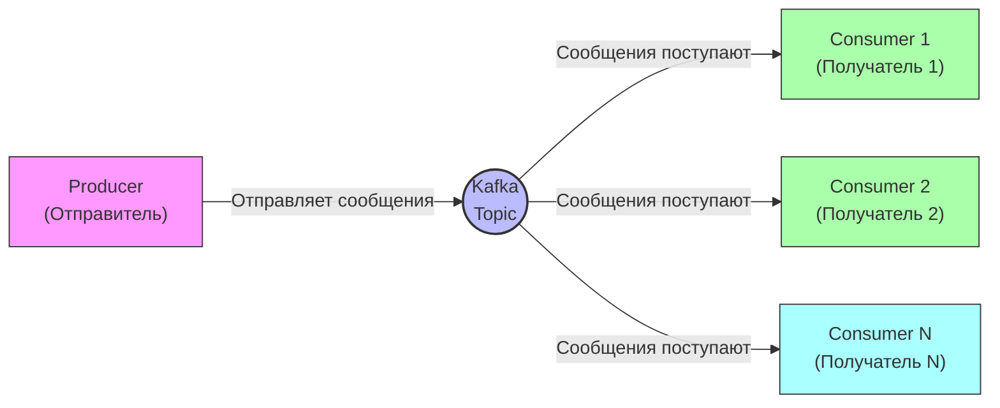
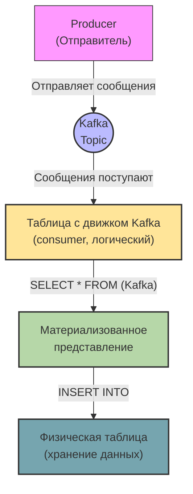
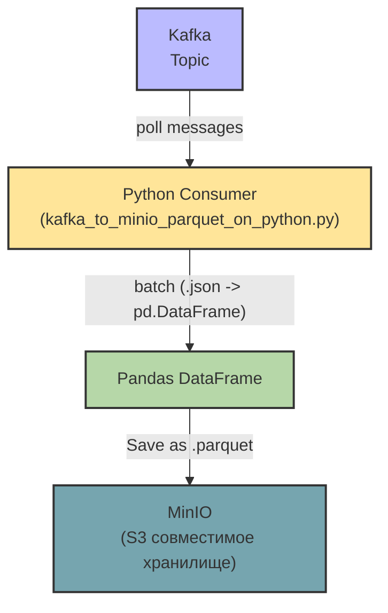

# Примеры использования Kafka

Kafka верхнеуровнево:



Kafka + ClickHouse верхнеуровнево:



Kafka + Python + MinIO верхнеуровнево:




## Команды и скрипты

### Создание виртуального окружения

```bash
python3.12 -m venv venv && \
source venv/bin/activate && \
pip install --upgrade pip && \
pip install poetry && \
poetry lock && \
poetry install
```

#### Добавление новых зависимостей в окружение

```bash
poetry lock && \
poetry install
```

### Поднятие инфраструктуры

```bash
docker compose up -d
```

Если отображаются исключения, то необходимо выполнить команду ниже, так как в проекте используется своя сборка Airflow:

```bash
docker compose build
```

### Подключение к Minio

Параметры подключения стандартные:

- `login`: `minioadmin`
- `password`: `minioadmin`

## TODO

- [ ] Описать получение Kafka CLI
- [ ] Команды чтения

```bash
docker exec -it kafka kafka-consumer-groups --bootstrap-server localhost:9092 --group ParquetConsumerGroup --describe
```

```bash
docker exec -it kafka kafka-consumer-groups --bootstrap-server localhost:9092 --group mygroup --describe
```

Очистка offset:
```bash
docker exec -it kafka kafka-consumer-groups --bootstrap-server localhost:9092 --group ParquetConsumerGroup --to-earliest --reset-offsets --execute --topic music_events
```


```bash
docker exec -it kafka kafka-consumer-groups --bootstrap-server localhost:9092 --group mygroup --to-earliest --reset-offsets --execute --topic music_events
```