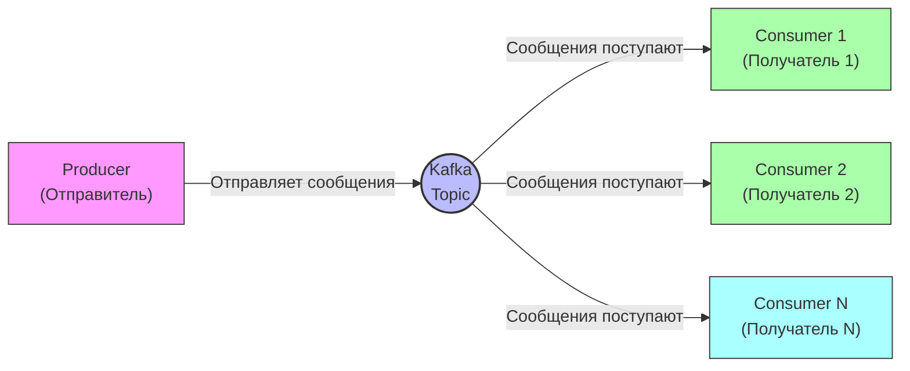
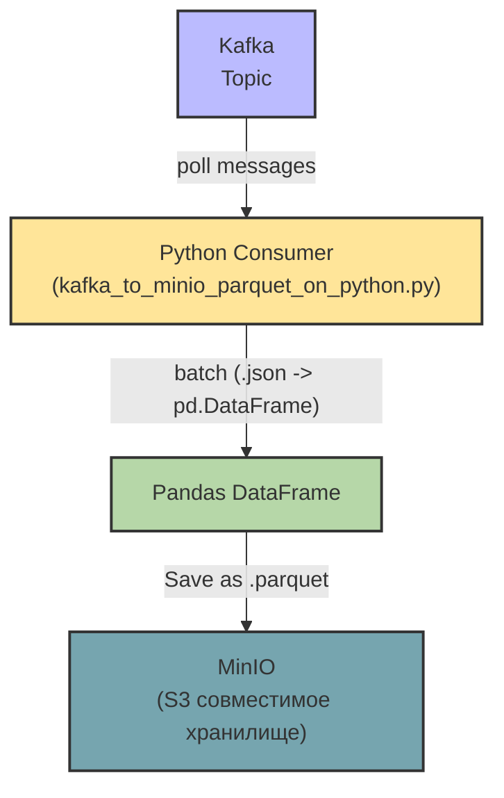
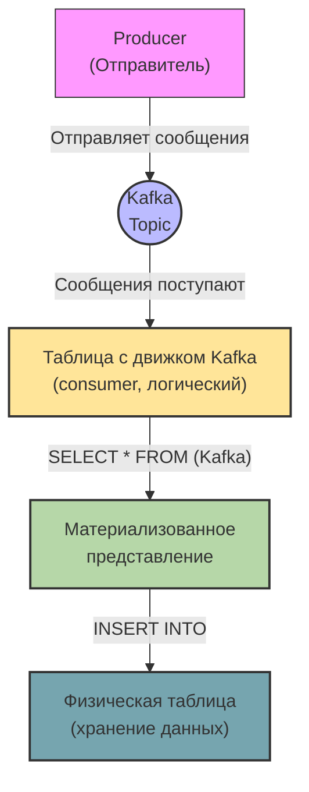

# Примеры использования Kafka

## Настройка проекта

### Создание виртуального окружения

```bash
python3.12 -m venv venv && \
source venv/bin/activate && \
pip install --upgrade pip && \
pip install poetry && \
poetry lock && \
poetry install
```

#### Добавление новых зависимостей в окружение

```bash
poetry lock && \
poetry install
```

### Поднятие инфраструктуры

```bash
docker compose up -d
```

### Подключение к Minio

Параметры подключения стандартные:

- `login`: `minioadmin`
- `password`: `minioadmin`

## Kafka

Перед дальнейшим чтением рекомендую свою статью –
[Инфраструктура для data engineer Kafka](https://habr.com/ru/articles/836302/).

Kafka – это брокер сообщений, который имеет принцип "*Write once read many (WORM)*".

Kafka верхнеуровнево:



### Простой `producer`

Запускаем [simple_producer.py](code/simple_producer.py)

#### Просмотр сообщений

Есть два варианта:

- В [Kafka UI](http://localhost:8080/)
- Через Kafka CLI

Просмотр сообщений "_Без группы_":

```bash
docker exec -it kafka kafka-console-consumer \
  --bootstrap-server localhost:9092 \
  --topic my_topic \
  --from-beginning
```

Просмотр сообщений "_Только новые_":

```bash
docker exec -it kafka kafka-console-consumer \
  --bootstrap-server localhost:9092 \
  --topic my_topic
```

Просмотр сообщений "_Новые не прочитанные_":

```bash
docker exec -it kafka kafka-console-consumer \
  --bootstrap-server localhost:9092 \
  --topic my_topic \
  --group mygroupcli
```

Прочитанные строки фиксируются в Kafka и мы можем это проверить командой:

```bash
docker exec -it kafka kafka-consumer-groups \
  --bootstrap-server localhost:9092 \
  --group mygroupcli \
  --describe 
```

## Clickstream

При запуске [simple_clickstream.py](code/simple_clickstream.py) эмулируется кликстрим музыкального сервиса.

В Kafka topic отправляются события:

| id | name_en                  | name_ru               |
|----|--------------------------|-----------------------|
| 1  | track_playback           | Воспроизведение трека |
| 2  | Pause_track              | Пауза трека           |
| 3  | resume_track             | Возобновление трека   |
| 4  | skipping_track_next      | Перелистывание вперёд |
| 5  | skipping_track_prev      | Перелистывание назад  |
| 6  | adding_track_to_playlist | Добавление в плейлист |
| 7  | track_like               | Лайк трека            |
| 8  | track_unlike             | Снятие лайка с трека  |

С определённым "_весом_" выбирается то или иное событие. Вы можете это регулировать самостоятельно в функции
`generate_realistic_event` в переменной `event_weights`.

Далее выбирается один из пользователей, который генерируются в `generate_users_df` и отправляется уже в Kafka topic
`music_events`.

## Задача дата-инженера

Собирать события для дальнейшей аналитики по сервису.

### Просмотр сообщений

Запускаем [simple_consumer.py](code/simple_consumer.py). Но нам этот вариант не подходит для работы, потому что он
только читает сообщения, но не собирает их.

### Сбор `events`

Рассмотрим два способа сбора `events`:

- Через Python + MinIO
- Через ClickHouse

#### Python + MinIO

Запускаем [kafka_to_minio_parquet_on_python.py](code/kafka_to_minio_parquet_on_python.py). Логика простая: мы читаем
топик `music_events` ждём "_отсечки_" по `BATCH_SIZE` и записываем данные в формате `.parquet` в нужно партицию.

Kafka + Python + MinIO верхнеуровнево:



##### Data quality

Для проверки качества данных, записанных в MinIO можно воспользоваться
[check_count_partition_prod_python.py](code/check_count_partition_prod_python.py).

Данный скрипт покажет:

1) Текущее количество строк в `bucket`
2) Текущая "_плоская_" модель данных в `bucket`
3) Первые десять (10) строк события `track_playback` (`1`)

#### ClickHouse

Перед дальнейшим чтением рекомендую свои статьи:

- [Инфраструктура для Data-Engineer ClickHouse](https://habr.com/ru/articles/842818/)
- [CDC на примитивах](https://habr.com/ru/articles/812797/)

Kafka + ClickHouse верхнеуровнево:



Создаём необходимые сущности для чтения Kafka.

> Ниже две модели, которые помогут прочитать топики: `music_events`, `my_topic` и сохранить данные.

```sql
DROP TABLE IF EXISTS kafka_simple_event_consumer;
DROP TABLE IF EXISTS kafka_simple_event_phys_table;
DROP TABLE IF EXISTS kafka_simple_event_mat_view;

CREATE TABLE kafka_simple_event_consumer
(
    uuid String,
    first_name String,
    last_name String,
    middle_name String,
    timestamp String
) ENGINE = Kafka SETTINGS
    kafka_broker_list = 'kafka',
    kafka_topic_list = 'my_topic',
    kafka_group_name = 'foo',
    kafka_format = 'JSON';
    
CREATE TABLE kafka_simple_event_phys_table
(
    uuid String,
    first_name String,
    last_name String,
    middle_name String,
    timestamp String
)
ENGINE = MergeTree()
ORDER BY (uuid);

CREATE MATERIALIZED VIEW kafka_simple_event_mat_view TO kafka_simple_event_phys_table 
    AS SELECT * FROM kafka_simple_event_consumer;

DROP TABLE IF EXISTS kafka_music_event_consumer;
DROP TABLE IF EXISTS kafka_music_event_phys_table;
DROP TABLE IF EXISTS kafka_music_event_mat_view;

CREATE TABLE kafka_music_event_consumer
(
    event_params String,
    event_timestamp_ms String
) ENGINE = Kafka SETTINGS
    kafka_broker_list = 'kafka',
    kafka_topic_list = 'music_events',
    kafka_group_name = 'foo',
    kafka_format = 'JSON';
    
CREATE TABLE kafka_music_event_phys_table
(
    event_params String,
    event_timestamp_ms String,
    uuid UUID DEFAULT generateUUIDv4() 
)
ENGINE = MergeTree()
ORDER BY (uuid);

CREATE MATERIALIZED VIEW kafka_music_event_mat_view TO kafka_music_event_phys_table 
    AS SELECT * FROM kafka_music_event_consumer;
```

Чтение топика `my_topic` в ClickHouse:

```sql
SELECT * FROM kafka_simple_event_mat_view;
```

Чтение топика `music_events` в ClickHouse:

```sql
SELECT * FROM kafka_music_event_mat_view;

SELECT * 
FROM kafka_music_event_mat_view
WHERE 1=1
AND JSONExtractInt(event_params, 'event_type_id') = 1;
```

## Рекомендации

1) Не забывайте создавать группу для чтения, чтобы фиксировать `offset`
2) Если у вас есть возможность читать данные в виде `.json`, чтобы не переживать за модель данных, используйте её.
3) Для чтения Kafka можно использовать и другие инструменты: Spark, Kafka Connect, NiFi и другие. Я показал просто
   примеры того как можно работать с топиками. Вы выбирайте инструмент "*по себе*"
4) Пробуйте другие форматы записи: `.avro`, Protobuf, String, Binary, etc
5) Не забывайте про партиционирование в Kafka и при сохранении информации
    1) Партиционирование в Kafka помогает быстрее читать и писать данные из/в топик
    2) Партиционирование в БД/S3 помогает быстрее читать и писать данные в конкретной партиции
6) Рекомендую книгу по
   Kafka – [Apache Kafka. Потоковая обработка и анализ данных, 2-е издание](https://www.piter.com/collection/bazy-dannyh/product/apache-kafka-potokovaya-obrabotka-i-analiz-dannyh-2-e-izdanie).
   Там много основ, которые до сих пор не устарели.
