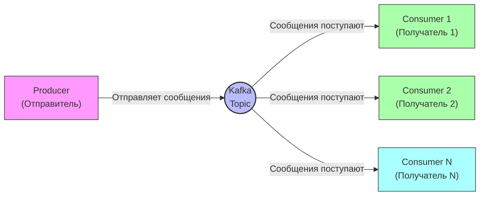
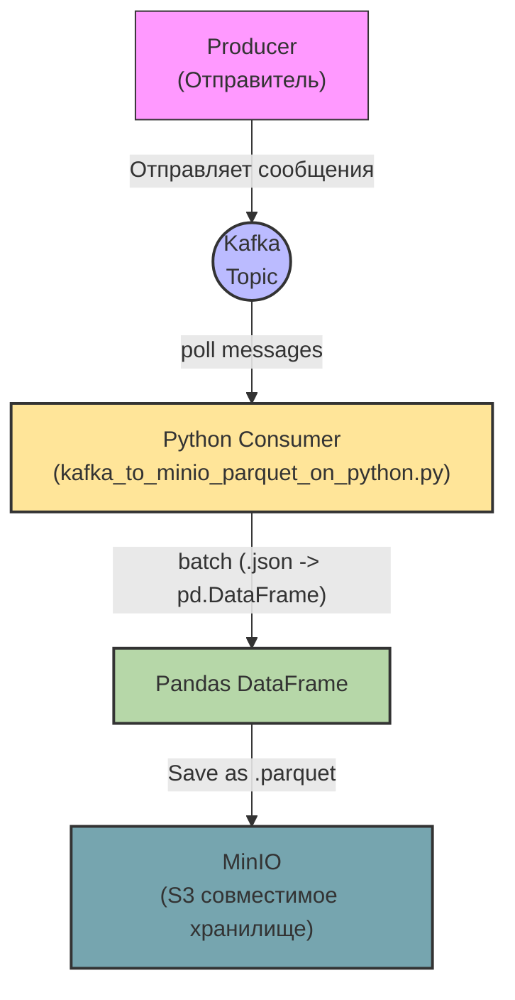
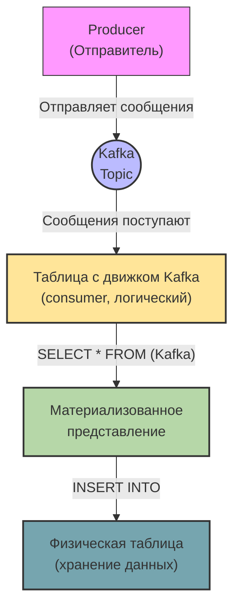

# Примеры использования Kafka

> [!NOTE]
> **TL;DR** Заменил нерабочий Minio S3 на рабочий Silo S3. Проект снова актуален. Все изменения отображены в PR [#1](https://github.com/k0rsakov/pet_project_real_usage_kafka/pull/1)

> [!IMPORTANT]
> [Minio](https://github.com/minio/minio) ушел из OpenSource, но Docker-образы были доступны.<br><br>
> 2026-09-14 на Reddit был опубликован
пост — [MinIO just removed their DockerHub image](https://www.reddit.com/r/minio/s/KxwCW1gKNE).<br><br>
> Я не сижу на Reddit 24/7 и поэтому увидел пост не сразу. Узнал об этом когда получил сообщение по типу: "_проект не
работает_".
> Проинформировал, что в курсе проблемы в своем tg-канале — [пост](https://t.me/DataLikeQWERTY/194).<br><br>
> Исследовал аналоги, думал взять совсем что-то другое, что описывал в этом [посте](https://t.me/DataLikeQWERTY/150)
>, но решил остановить свой выбор на fork Minio — [PGSTY Silo](https://github.com/pgsty/silo).
> На текущий момент (2026-10-05) Minio заменен на Silo. Более подробно описано в PR [#1](https://github.com/k0rsakov/pet_project_real_usage_kafka/pull/1)

## Описание YouTube

🔥 В этом [видео](https://youtu.be/R2yGsEfPKS4) ты узнаешь всё, что должен знать дата-инженер о Apache Kafka.
Показываю реальный практический кейс: как собирать, хранить и анализировать данные событий (clickstream) с помощью
Kafka, Python, S3 (MinIO) и ClickHouse.

Ссылки:
- Менторство/консультации по IT – https://korsak0v.notion.site/Data-Engineer-185c62fdf79345eb9da9928356884ea0
- TG канал – https://t.me/DataLikeQWERTY
- Instagram – https://www.instagram.com/i__korsakov/
- Habr – https://habr.com/ru/users/k0rsakov/publications/articles/
- GitHub проекта – https://github.com/k0rsakov/pet_project_real_usage_kafka
- Инфраструктура для data engineer Kafka – https://habr.com/ru/articles/836302/

🔻 Что тебя ждет:

- Что такое Kafka, зачем она нужна и как работает принцип WORM (Write Once Read Many)
- Как устроены сообщения, топики и группы в Kafka (на живых примерах)
- Как писать и читать сообщения в Kafka через Python и CLI
- Как собирать clickstream для музыкального сервиса
- Как сохранять данные из Kafka в S3 (Minio) в формате Parquet
- Как читать данные из Kafka и S3 в ClickHouse
- Советы и лучшие практики для дата-инженеров при работе с Kafka
- Топовые ошибки, которые совершают новички (и как их избежать)
- Сравнение инструментов: Spark, Kafka Connect, NiFi и др.
- Рекомендации по выбору формата данных и партиционированию

💡 В конце ролика — советы, которые сэкономят тебе кучу времени и нервов!

Таймкоды:

- 00:00 – Начало
- 01:04 – Что такое Kafka (Кафка)
- 03:06 – Свойства и специфика Kafka (Кафки)
- 03:45 – Что такое Producer (Продюсер)
- 04:05 – Что такое Consumer (Консумер)
- 05:10 – Разбор инфраструктуры проекта
- 06:35 – Запуск кода для записи в Kafka (Кафку)
- 07:56 – Изучение интерфейса Kafka UI (Кафки)
- 09:24 – Чтение Kafka (Кафки) через командную строку (CLI)
- 12:22 – Чтение Kafka (Кафки) через командную строку (CLI) при указании группы и объяснение что такое группа
- 15:45 – Чем можно читать Kafka (Кафку)
- 16:45 – Разбор типовой задачи дата-инженера, связанной с Kafka (Кафкой)
- 17:55 – Разбор ClickStream (кликстрима)
- 20:25 – Предпочтительный вариант записи в Kafka (Кафку)
- 22:52 – Запуск ClickStream
- 24:40 – Простое чтение Kafka (Кафки) через Python (питон)
- 25:28 – Запись данных из Kafka (Кафки) в s3 через Python (питон)
- 29:36 – Чтение Kafka (Кафки) и запись в ClickHouse (кликхаус) через ClickHouse (кликхаус)
- 35:00 – Разбор архитектуры приложения на Python (питоне) для работы с Kafka (Кафкой)
- 36:42 – Разбор архитектуры приложения на ClickHouse (кликхаус) для работы с Kafka (Кафкой)
- 37:27 – Модели ClickHouse (кликхауса) для работы с Kafka (Кафкой)
- 37:38 – Рекомендации

## Настройка проекта

### Создание виртуального окружения

```bash
python3.12 -m venv venv && \
source venv/bin/activate && \
pip install --upgrade pip && \
pip install poetry && \
poetry lock && \
poetry install
```

#### Добавление новых зависимостей в окружение

```bash
poetry lock && \
poetry install
```

### Поднятие инфраструктуры

```bash
docker compose up -d
```

### Подключение к Minio

Параметры подключения стандартные:

- `login`: `minioadmin`
- `password`: `minioadmin`

## Kafka

Перед дальнейшим чтением рекомендую свою статью –
[Инфраструктура для data engineer Kafka](https://habr.com/ru/articles/836302/).

Kafka – это брокер сообщений, который имеет принцип "*Write once read many (WORM)*".

Kafka верхнеуровнево:


```mermaid
flowchart LR
    A["Producer<br>(Отправитель)"] -- Отправляет сообщения --> B((Kafka<br>Topic))
    B -- Сообщения поступают --> C["Consumer 1<br>(Получатель 1)"]
    B -- Сообщения поступают --> D["Consumer 2<br>(Получатель 2)"]
    B -- Сообщения поступают --> F["Consumer N<br>(Получатель N)"]

    style A fill:#f9f,stroke:#333,stroke-width:1px
    style B fill:#bbf,stroke:#333,stroke-width:2px
    style C fill:#afa,stroke:#333,stroke-width:1px
    style D fill:#afa,stroke:#333,stroke-width:1px
    style F fill:#aff,stroke:#333,stroke-width:1px
```

### Простой `producer`

Запускаем [simple_producer.py](code/simple_producer.py)

#### Просмотр сообщений

Есть два варианта:

- В [Kafka UI](http://localhost:8080/)
- Через Kafka CLI

Просмотр сообщений "_Без группы_":

```bash
docker exec -it kafka kafka-console-consumer \
  --bootstrap-server localhost:9092 \
  --topic my_topic \
  --from-beginning
```

Просмотр сообщений "_Только новые_":

```bash
docker exec -it kafka kafka-console-consumer \
  --bootstrap-server localhost:9092 \
  --topic my_topic
```

Просмотр сообщений "_Новые не прочитанные_":

```bash
docker exec -it kafka kafka-console-consumer \
  --bootstrap-server localhost:9092 \
  --topic my_topic \
  --group mygroupcli
```

Прочитанные строки фиксируются в Kafka и мы можем это проверить командой:

```bash
docker exec -it kafka kafka-consumer-groups \
  --bootstrap-server localhost:9092 \
  --group mygroupcli \
  --describe 
```

## Clickstream

При запуске [simple_clickstream.py](code/simple_clickstream.py) эмулируется кликстрим музыкального сервиса.

В Kafka topic отправляются события:

| id | name_en                  | name_ru               |
|----|--------------------------|-----------------------|
| 1  | track_playback           | Воспроизведение трека |
| 2  | pause_track              | Пауза трека           |
| 3  | resume_track             | Возобновление трека   |
| 4  | skipping_track_next      | Перелистывание вперёд |
| 5  | skipping_track_prev      | Перелистывание назад  |
| 6  | adding_track_to_playlist | Добавление в плейлист |
| 7  | track_like               | Лайк трека            |
| 8  | track_unlike             | Снятие лайка с трека  |

С определённым "_весом_" выбирается то или иное событие. Вы можете это регулировать самостоятельно в функции
`generate_realistic_event` в переменной `event_weights`.

Далее выбирается один из пользователей, который генерируются в `generate_users_df` и отправляется уже в Kafka topic
`music_events`.

## Задача дата-инженера

Собирать события для дальнейшей аналитики по сервису.

### Просмотр сообщений

Запускаем [simple_consumer.py](code/simple_consumer.py). Но нам этот вариант не подходит для работы, потому что он
только читает сообщения, но не собирает их.

### Сбор `events`

Рассмотрим два способа сбора `events`:

- Через Python + MinIO
- Через ClickHouse

#### Python + MinIO

Запускаем [kafka_to_minio_parquet_on_python.py](code/kafka_to_minio_parquet_on_python.py). Логика простая: мы читаем
топик `music_events` ждём "_отсечки_" по `BATCH_SIZE` и записываем данные в формате `.parquet` в нужно партицию.

Kafka + Python + MinIO верхнеуровнево:


```mermaid
flowchart TB
    AA["Producer<br>(Отправитель)"] -- Отправляет сообщения --> A((Kafka<br>Topic))
    A(("Kafka<br>Topic")) -- poll messages --> B["Python Consumer<br>(kafka_to_minio_parquet_on_python.py)"]
    B -- batch (.json -> pd.DataFrame) --> C["Pandas DataFrame"]
    C -- Save as .parquet --> D["MinIO<br>(S3 совместимое хранилище)"]

    style AA fill:#f9f,stroke:#333,stroke-width:1px
    style A fill:#bbf,stroke:#333,stroke-width:2px
    style B fill:#ffe599,stroke:#333,stroke-width:2px
    style C fill:#b6d7a8,stroke:#333,stroke-width:2px
    style D fill:#76a5af,stroke:#333,stroke-width:2px
```

##### Data quality

Для проверки качества данных, записанных в MinIO можно воспользоваться
[check_count_partition_prod_python.py](code/check_count_partition_prod_python.py).

Данный скрипт покажет:

1) Текущее количество строк в `bucket`
2) Текущая "_плоская_" модель данных в `bucket`
3) Первые десять (10) строк события `track_playback` (`1`)

#### ClickHouse

Перед дальнейшим чтением рекомендую свои статьи:

- [Инфраструктура для Data-Engineer ClickHouse](https://habr.com/ru/articles/842818/)
- [CDC на примитивах](https://habr.com/ru/articles/812797/)

Kafka + ClickHouse верхнеуровнево:


```mermaid
flowchart TB
    A["Producer<br>(Отправитель)"] -- Отправляет сообщения --> B((Kafka<br>Topic))
    B -- Сообщения поступают --> C["Таблица с движком Kafka<br>(consumer, логический)"]
    C -- SELECT * FROM (Kafka) --> D["Материализованное<br>представление"]
    D -- INSERT INTO --> E["Физическая таблица<br>(хранение данных)"]

    style A fill:#f9f,stroke:#333,stroke-width:1px
    style B fill:#bbf,stroke:#333,stroke-width:2px
    style C fill:#ffe599,stroke:#333,stroke-width:2px
    style D fill:#b6d7a8,stroke:#333,stroke-width:2px
    style E fill:#76a5af,stroke:#333,stroke-width:2px
```

Создаём необходимые сущности для чтения Kafka.

> Ниже две модели, которые помогут прочитать топики: `music_events`, `my_topic` и сохранить данные.

```sql
DROP TABLE IF EXISTS kafka_simple_event_consumer;
DROP TABLE IF EXISTS kafka_simple_event_phys_table;
DROP TABLE IF EXISTS kafka_simple_event_mat_view;

CREATE TABLE kafka_simple_event_consumer
(
    uuid String,
    first_name String,
    last_name String,
    middle_name String,
    timestamp String
) ENGINE = Kafka SETTINGS
    kafka_broker_list = 'kafka',
    kafka_topic_list = 'my_topic',
    kafka_group_name = 'foo',
    kafka_format = 'JSON';
    
CREATE TABLE kafka_simple_event_phys_table
(
    uuid String,
    first_name String,
    last_name String,
    middle_name String,
    timestamp String
)
ENGINE = MergeTree()
ORDER BY (uuid);

CREATE MATERIALIZED VIEW kafka_simple_event_mat_view TO kafka_simple_event_phys_table 
    AS SELECT * FROM kafka_simple_event_consumer;

DROP TABLE IF EXISTS kafka_music_event_consumer;
DROP TABLE IF EXISTS kafka_music_event_phys_table;
DROP TABLE IF EXISTS kafka_music_event_mat_view;

CREATE TABLE kafka_music_event_consumer
(
    event_params String,
    event_timestamp_ms String
) ENGINE = Kafka SETTINGS
    kafka_broker_list = 'kafka',
    kafka_topic_list = 'music_events',
    kafka_group_name = 'foo',
    kafka_format = 'JSON';
    
CREATE TABLE kafka_music_event_phys_table
(
    event_params String,
    event_timestamp_ms String,
    uuid UUID DEFAULT generateUUIDv4() 
)
ENGINE = MergeTree()
ORDER BY (uuid);

CREATE MATERIALIZED VIEW kafka_music_event_mat_view TO kafka_music_event_phys_table 
    AS SELECT * FROM kafka_music_event_consumer;
```

Чтение данных из топика `my_topic` в ClickHouse:

```sql
SELECT * FROM kafka_simple_event_mat_view;
```

Чтение данных из топика `music_events` в ClickHouse:

```sql
SELECT * FROM kafka_music_event_mat_view;

SELECT * 
FROM kafka_music_event_mat_view
WHERE 1=1
AND JSONExtractInt(event_params, 'event_type_id') = 1;
```

## Рекомендации

1) Не забывайте создавать группу для чтения, чтобы фиксировать `offset`
2) Если у вас есть возможность читать данные в виде `.json`, чтобы не переживать за модель данных, используйте её.
3) Для чтения Kafka можно использовать и другие инструменты: Spark, Kafka Connect, NiFi и другие. Я показал просто
   примеры того как можно работать с топиками. Вы выбирайте инструмент "*по себе*"
4) Пробуйте другие форматы записи: `.avro`, Protobuf, String, Binary, etc
5) Не забывайте про партиционирование в Kafka и при сохранении информации
    1) Партиционирование в Kafka помогает быстрее читать и писать данные из/в топик
    2) Партиционирование в БД/S3 помогает быстрее читать и писать данные в конкретной партиции
6) Рекомендую книгу по
   Kafka – [Apache Kafka. Потоковая обработка и анализ данных, 2-е издание](https://www.piter.com/collection/bazy-dannyh/product/apache-kafka-potokovaya-obrabotka-i-analiz-dannyh-2-e-izdanie).
   Там много основ, которые до сих пор не устарели.
